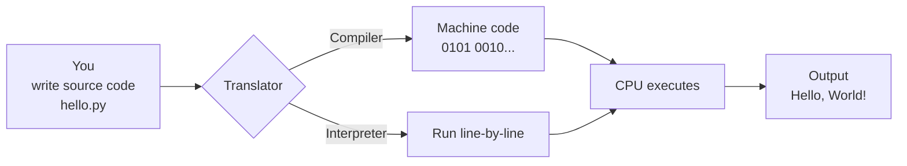
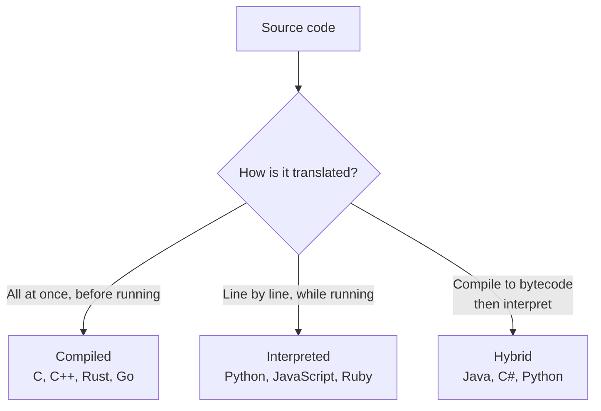
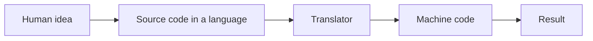

# What is a Programming Language?

> A **programming language** is a formal set of words, symbols, and rules that a human writes to tell a computer what to do.

Computers only understand **binary** — the 1s and 0s called *machine code*. A programming language is the bridge between human logic and machine execution.

---

## 1. Why do we even need a language?

- Writing raw binary by hand is impossible at human scale.
- A language gives us readable **syntax** — words, symbols, and rules — to express logic.
- A **translator** (compiler or interpreter) turns that text into machine code the CPU can run.

---

## 2. How a program actually runs

You write **source code** in a language like Python. A **compiler** or **interpreter** translates it into instructions the CPU can execute. The CPU runs those instructions and produces output.

---

## 3. Categories of programming languages

Two useful axes: **how close to hardware** the language is, and **how it gets translated**.

### By level

| Level          | Close to…       | Examples                          | Trade-off                         |
| -------------- | --------------- | --------------------------------- | --------------------------------- |
| **Low-level**  | Hardware / CPU  | Machine code, Assembly            | Very fast, very hard to write     |
| **High-level** | Human language  | Python, JavaScript, Java, C++     | Easier to read; small speed cost  |

### By translation strategy

| Strategy        | Speed         | Flexibility            | Examples                  |
| --------------- | ------------- | ---------------------- | ------------------------- |
| **Compiled**    | Fastest       | Less flexible at runtime | C, C++, Rust, Go          |
| **Interpreted** | Slower        | Very flexible (REPLs)  | Python, JavaScript, Ruby  |
| **Hybrid**      | In-between    | Best of both           | Java (JVM), Python (CPython), C# (.NET) |

> **Where Python sits:** Python is technically *hybrid* — your `.py` file is compiled to bytecode (`.pyc`), then a virtual machine interprets that bytecode. From a beginner's view, it feels interpreted: you save a file, you run it.

---

## 4. The takeaway

You don't need to memorize this taxonomy. The important idea is:

Every language — Python, Java, Rust, JavaScript — solves the same translation problem in slightly different ways. From here on, we focus on *one* language: **Python**.
