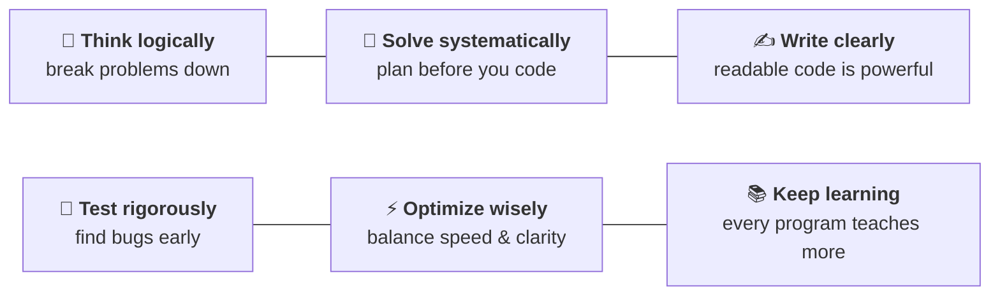
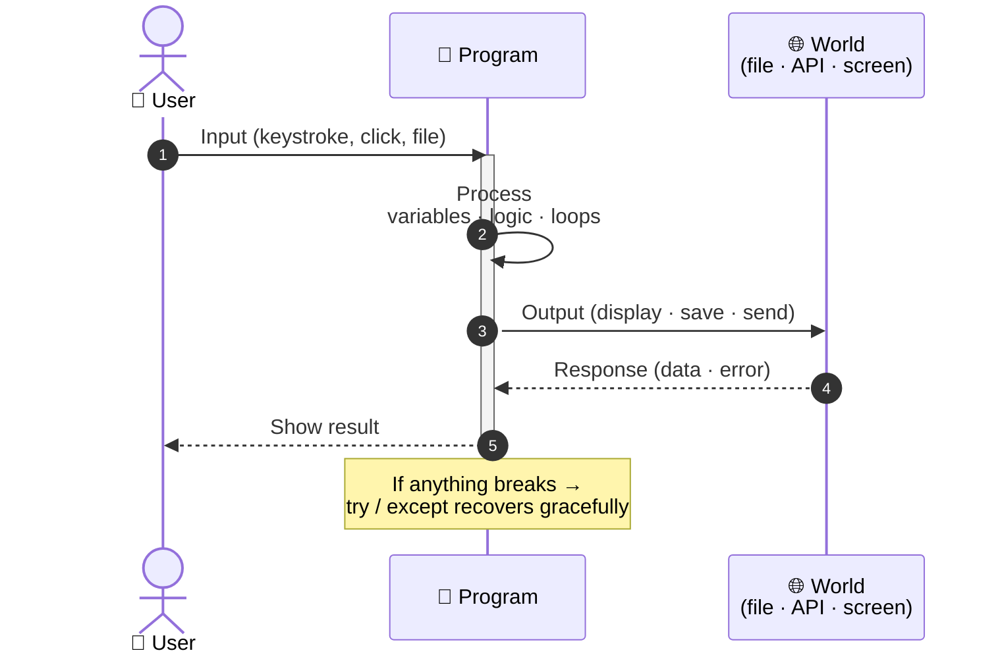
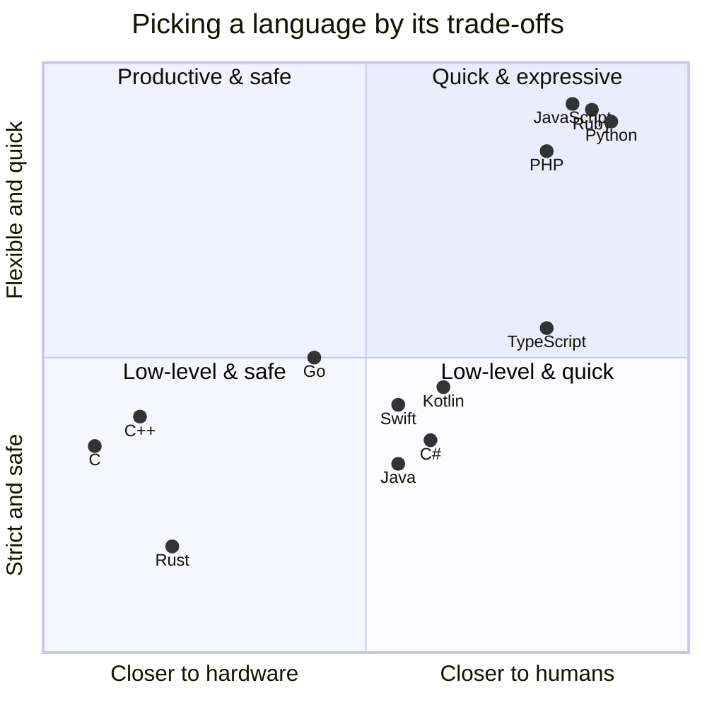
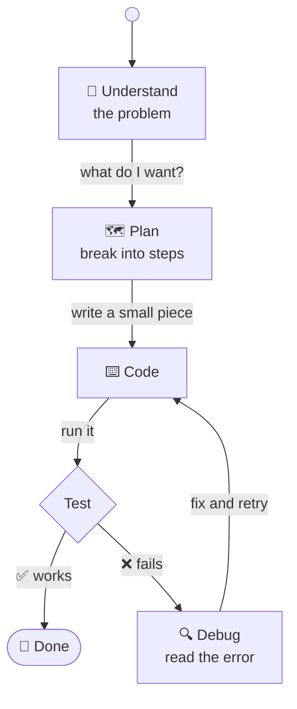

# Core Programming Concepts

> Before we touch any specific language, let's name the **nine ideas** every programmer uses every day. Once these click, learning a new language becomes mostly learning new syntax for the same ideas.

---

## 1. The nine building blocks

A radial map of everything that lives inside any program — *anywhere*, in *any* language.

```concept-map
9-building-blocks
```

> Memorize the *names*. The details come naturally as you use them.

### Six universal habits behind every program



> *Code is a language. Logic is universal.*

---

## 2. How a program actually thinks

Every program is a **conversation** between you, the program, and the world. A sequence diagram makes the back-and-forth obvious.



A whole web app, a calculator, and a spreadsheet macro all follow the same shape — they just have *more* of each piece.

---

## 3. Popular languages and where they shine

Languages live on two axes: **how close to the hardware** vs **how strict the rules are**. The chart below places the popular ones — pick the quadrant that matches your problem.



> **Python sits in the top-right** — close to humans, flexible, and quick to write. That's why it's such a strong first language: what you learn here transfers anywhere on the chart.

---

## 4. The mindset shift

Coding isn't a straight line — it's a small **state machine** you cycle through, sometimes a hundred times in one afternoon.



You'll write something, run it, watch it break, fix it, run again. That loop *is* the job.

> If you can explain your solution out loud, step by step, you can almost always write it in code.

Once these fundamentals click, learning a new language is mostly *new syntax for ideas you already know.*
