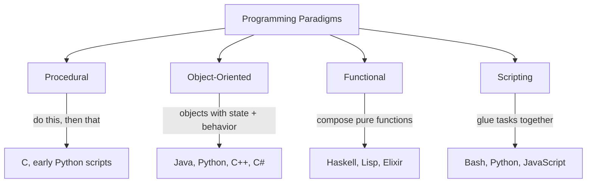
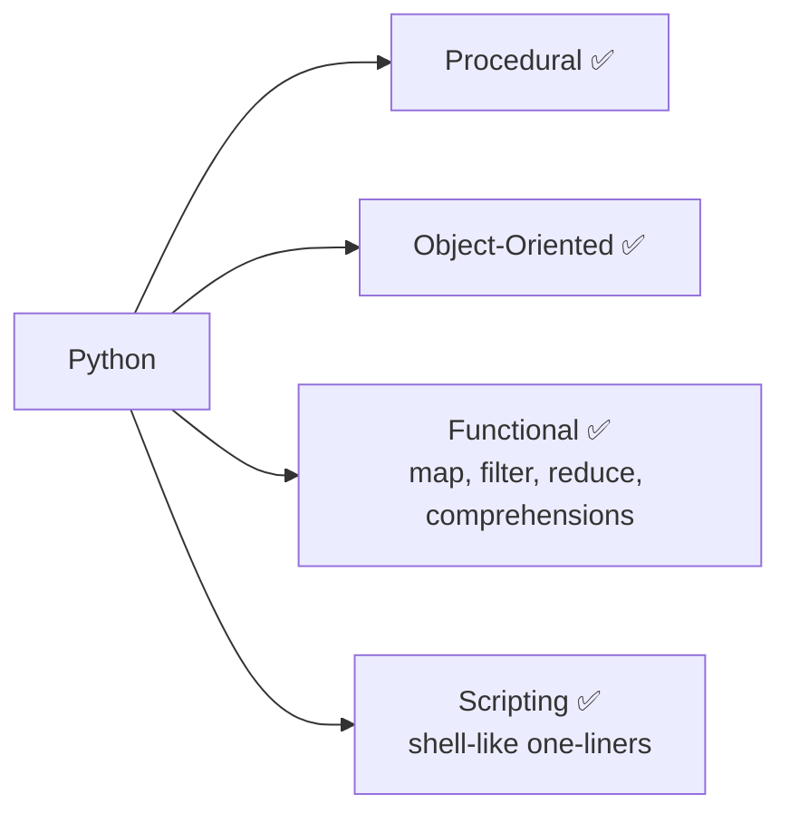

# Programming Paradigms

A **paradigm** is a *style* of writing code — a way of thinking about a problem. Most modern languages let you mix styles, but each style has a different "default mood." Knowing the moods helps you read other people's code and pick the right tool for a job.

---

## 1. The four styles you'll meet



| Paradigm            | The big idea                                                   | Strength                            | Watch out for                  |
| ------------------- | -------------------------------------------------------------- | ----------------------------------- | ------------------------------ |
| **Procedural**      | A list of steps the computer follows top to bottom             | Easy to learn, easy to read         | Hard to scale to big systems   |
| **Object-Oriented** | Bundle data + behavior into "objects" that talk to each other  | Models real-world things naturally  | Can over-engineer simple tasks |
| **Functional**      | Build the answer by composing small, pure, predictable funcs   | Easier to test, parallelize, reason | Steeper learning curve         |
| **Scripting**       | Short programs that automate a task, often glue between tools  | Fast to write, fast to throw away   | Not built for huge codebases   |

---

## 2. Same problem, four flavors

Sum the numbers 1 through 5:

```python
# procedural — explicit steps
total = 0
for n in [1, 2, 3, 4, 5]:
    total = total + n
print(total)  # 15

# functional — describe the answer
from functools import reduce
print(reduce(lambda a, b: a + b, [1, 2, 3, 4, 5]))  # 15

# object-oriented — wrap behavior in an object
class Adder:
    def __init__(self): self.total = 0
    def add(self, n): self.total += n
a = Adder()
for n in [1, 2, 3, 4, 5]: a.add(n)
print(a.total)  # 15

# scripting one-liner
print(sum([1, 2, 3, 4, 5]))  # 15
```

Same answer. Different *way of thinking*.

---

## 3. Where does Python fit in?

> **Python is a high-level, interpreted, multi-paradigm language.**
> You can write it as a script, as objects, or as pure functions — often in the same file.



That flexibility, plus its very readable syntax, is why Python is one of the best first languages to learn — and one of the few languages that stays useful from your first script to a billion-user product.
