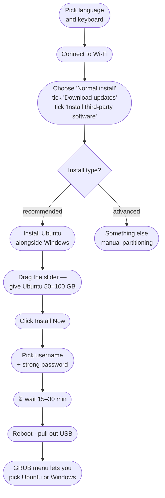

# Migrate from Windows to Ubuntu

> Most professional Python work happens on Linux. Servers run Linux, Docker images are Linux, most tutorials assume Linux. Switching your daily driver to Ubuntu is the single biggest setup decision you can make for a serious Python journey.

Don't worry — you don't have to *delete* Windows. The clean path is a **dual boot**: keep Windows on the drive, install Ubuntu beside it, and pick which one to use when you turn on the laptop.

---

## 1. The full path at a glance


> ⏱ **Time:** about 60–90 minutes once you have the USB drive.

---

## 2. What you'll need

- A **USB pendrive**, at least **8 GB**. *Anything on it will be erased*, so use a spare one.
- A laptop or PC with **at least 25 GB free** on its main drive (50 GB is comfortable).
- Your **laptop's charger plugged in** — you do not want it to die mid-install.
- About **an hour of patience**.
- A **second device** (phone is fine) to read these instructions while you install.

---

## 3. Download the tools

You need two files: the Ubuntu installer (the **ISO**) and the tool that writes it to USB (**Rufus**).

### 3.1 Ubuntu (the OS)

- Go to **<https://ubuntu.com/download/desktop>**
- Pick the latest **LTS** release (Long-Term Support — supported for 5 years).
- The download is ~5 GB. Save it somewhere you can find it again, like `Downloads/ubuntu-XX.XX-desktop-amd64.iso`.

### 3.2 Rufus (the USB writer)

- Go to **<https://rufus.ie>**
- Scroll to **Download** and grab the latest `rufus-X.XX.exe` (no installer needed — it runs as a single file).

> **Why Rufus?** It's free, open source, runs directly without installing, and is the most reliable way to create a bootable Linux USB on Windows.

---

## 4. Create the bootable USB


**Step by step**

1. Plug the pendrive into your Windows PC.
2. Open **Rufus** (double-click `rufus-X.XX.exe`).
3. In **Device**, pick your USB drive. *Double-check this — the wrong drive will be erased.*
4. Next to **Boot selection**, click **SELECT** and choose the Ubuntu `.iso` you downloaded.
5. **Partition scheme** → `GPT`, **Target system** → `UEFI (non CSM)`.
6. Leave the rest as default. Click **START**.
7. If it asks "Write in ISO Image mode" or "DD mode" → pick **ISO Image mode**.
8. Wait until it says **READY**. Eject the USB safely.

> ⚠️ Everything that was on the pendrive is now gone. That's normal.

---

## 5. Back up your files (don't skip this)

The Ubuntu installer is safe and modern, but *anything* that touches partitions has a small risk. Before you boot from the USB:

- Copy `Documents`, `Desktop`, `Pictures`, project folders to an **external drive** or a cloud (Google Drive, OneDrive, GitHub).
- Note your **Wi-Fi password** somewhere — you'll need it after install.
- Note any **license keys** for paid Windows apps you use.

> If something goes wrong, you can always reinstall Windows. You can't always recover lost photos.

---

## 6. Disable Secure Boot (in BIOS / UEFI)

Most modern laptops ship with **Secure Boot ON**. It blocks unsigned bootloaders, which sometimes blocks Ubuntu's installer. Turn it off, install, then turn it back on later if you want.

### 6.1 Enter the BIOS / UEFI


The **BIOS key** depends on your laptop. Tap it repeatedly the moment you press power:

| Brand               | Key             |
| ------------------- | --------------- |
| **Dell**            | `F2` or `F12`   |
| **HP**              | `F10` or `Esc`  |
| **Lenovo / ThinkPad** | `F1` or `F2` (Novo button on some models) |
| **Acer**            | `F2`            |
| **Asus**            | `F2` or `Del`   |
| **MSI**             | `Del`           |
| **Samsung**         | `F2`            |
| **Surface**         | hold **Volume Up** while powering on |

### 6.2 Turn off Secure Boot

Inside BIOS:

1. Find the **Boot** or **Security** tab (use arrow keys — most BIOSes don't have a mouse).
2. Locate **Secure Boot** → set it to **Disabled**.
3. *Optional but helpful:* set **Boot Mode** = `UEFI` (not Legacy), and **Fast Boot** = `Disabled`.
4. Press **F10** (or whatever the screen shows) to **Save and Exit**.

### 6.3 Alternative: from inside Windows

If tapping the BIOS key isn't working, you can reach UEFI from Windows:

```
Settings → System → Recovery → Advanced startup → Restart now
→ Troubleshoot → Advanced options → UEFI Firmware Settings → Restart
```

---

## 7. Boot from the USB

1. Plug the bootable USB in.
2. Restart the laptop and tap the **boot menu key** (usually `F12`, `F9`, `Esc`, or `F11` — different from BIOS).
3. From the boot menu, pick **your USB drive** (it'll say something like `UEFI: SanDisk USB`).
4. You'll see Ubuntu's purple **GRUB** menu. Press **Enter** on `Try or Install Ubuntu`.
5. After ~30 seconds you'll be in a *live* Ubuntu — clicking around does nothing permanent yet. Double-click **Install Ubuntu**.

---

## 8. Install Ubuntu (alongside Windows)



Key choices:

- **Install Ubuntu alongside Windows Boot Manager** — keeps Windows. Recommended for first-timers.
- **Erase disk and install Ubuntu** — *deletes Windows entirely*. Only pick this if you've decided to fully switch.
- **Username + password** — pick a strong password. You'll type it a lot when running `sudo`.

When the installer finishes, click **Restart Now**, *pull out the USB when it tells you to*, and press Enter. Next boot will show a **GRUB** menu where you can pick Ubuntu or Windows.

---

## 9. First things to install for Python

Open a **Terminal** (Ctrl+Alt+T) and run:

```
sudo apt update && sudo apt upgrade -y
sudo apt install -y python3 python3-pip python3-venv git build-essential curl
```

Then install **VS Code**:

```
sudo snap install code --classic
```

Verify everything:

```
python3 --version
pip3 --version
git --version
code --version
```

You're now on Linux. Most Python tutorials, Docker, every cloud server you'll ever SSH into — they all speak this same language.

---

## 10. Useful links

- Ubuntu download: <https://ubuntu.com/download/desktop>
- Rufus: <https://rufus.ie>
- Official Ubuntu tutorial (mirrors what we did): <https://ubuntu.com/tutorials/install-ubuntu-desktop>
- Manufacturer BIOS keys (full list): <https://www.tomshardware.com/reviews/bios-keys-to-access-your-firmware,5732.html>
- Beginner Ubuntu tips: <https://ubuntu.com/tutorials>

> **Stuck somewhere?** The Ubuntu community on Reddit (`r/Ubuntu`) and Ask Ubuntu (`askubuntu.com`) answer beginner questions kindly and within hours.

Welcome to Linux 🐧.
