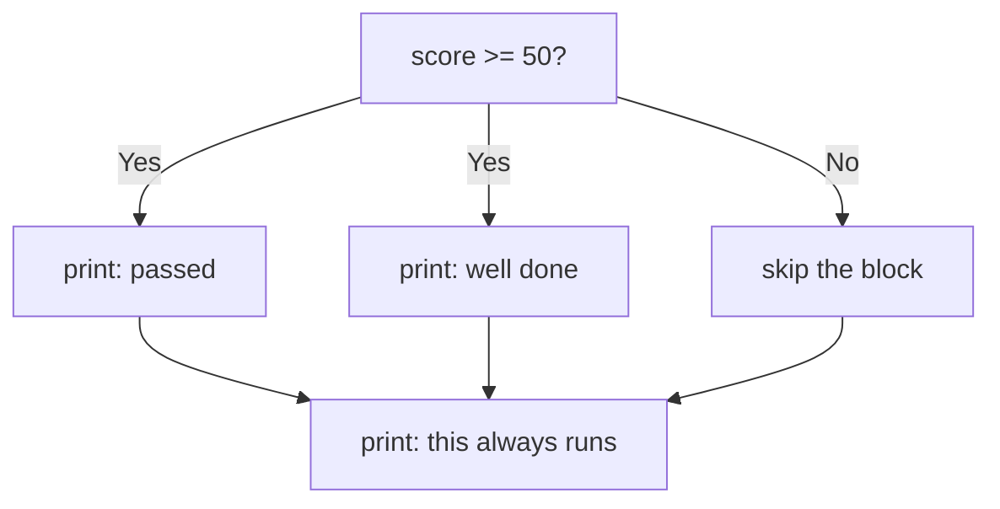
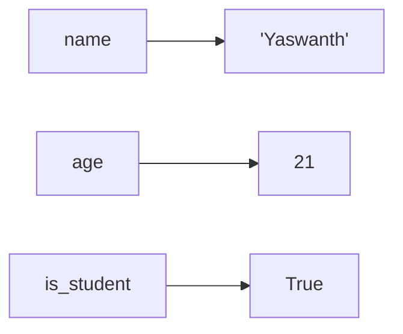
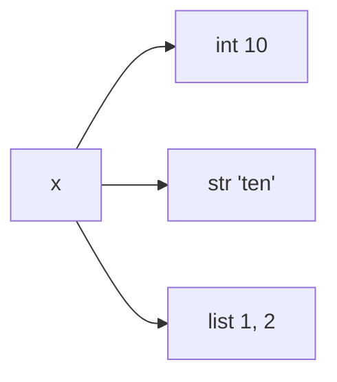
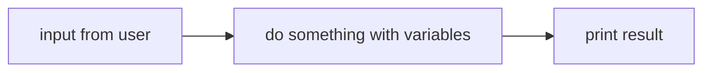

# Module 2 — Syntax and Basic Concepts

Python's syntax was designed to look almost like English. By the end of this module, you'll know the **shape** of a Python program: how lines are organized, how to make notes for yourself, and how to talk to the user.

---

## 1. Indentation is the syntax

Most languages use `{ }` to group code. Python uses **indentation** (4 spaces) — the whitespace itself is part of the language.

```python
if score >= 50:
    print("You passed!")
    print("Well done.")
print("This always runs.")
```



> **Rule:** every line inside the *same block* must have the *same* indentation. Mix tabs and spaces and Python will refuse to run.

---

## 2. Comments — notes for humans

Comments are ignored by Python. They exist for *you* and *future you*.

```python
# Single-line comment with a hash

x = 42  # inline comment after code

"""
Triple-quoted strings are often used
as multi-line "comments" or as docstrings
that describe what a function does.
"""
```

---

## 3. Variables — boxes with names

A variable is a **name** that points to a **value** in memory.

```python
name = "Yaswanth"
age = 21
is_student = True
```



### Naming rules (and the PEP 8 style)

| Rule                                  | ✅ Good          | ❌ Bad           |
| ------------------------------------- | --------------- | --------------- |
| Letters, digits, underscores only     | `user_name`     | `user-name`     |
| Cannot start with a digit             | `score_1`       | `1_score`       |
| Case-sensitive                        | `Age != age`    | —               |
| Use `snake_case` for vars / funcs     | `total_price`   | `TotalPrice`    |
| `UPPER_CASE` for constants            | `MAX_RETRIES`   | `maxRetries`    |
| Avoid Python keywords                 | `class_name`    | `class`         |

---

## 4. Dynamic typing

Python figures out the type from the value. You don't declare it up front, and a variable can change type later.

```python
x = 10        # int
x = "ten"     # now a str — Python doesn't complain
x = [1, 2]    # now a list — still fine
```



> **Trade-off:** super flexible to write, easier to break at runtime. We'll see *type hints* later as a way to get the best of both worlds.

---

## 5. Talking to the user — `input()` and `print()`

The simplest two-way conversation a Python program can have.

```python
name = input("What is your name? ")   # reads a line of text
print("Hello,", name + "!")            # shows it back
```

`input()` **always returns a string.** If you need a number, convert it:

```python
age_text = input("Your age? ")  # "21"
age = int(age_text)             # 21
print("Next year you'll be", age + 1)
```

---

## 6. The shape of a tiny program



```python
# greet.py
name = input("Your name: ")
greeting = "Welcome, " + name
print(greeting)
```

That's it — every Python program, no matter how big, is built from these same pieces.

---

## ✅ Recap

- Indentation defines blocks. Use 4 spaces.
- `#` is a comment; `"""..."""` works as a multi-line note or docstring.
- Variables are names that point to values; Python infers the type.
- Use `snake_case`; constants in `UPPER_CASE`.
- `input()` reads text. `print()` shows output. Cast with `int()` / `float()` when needed.
